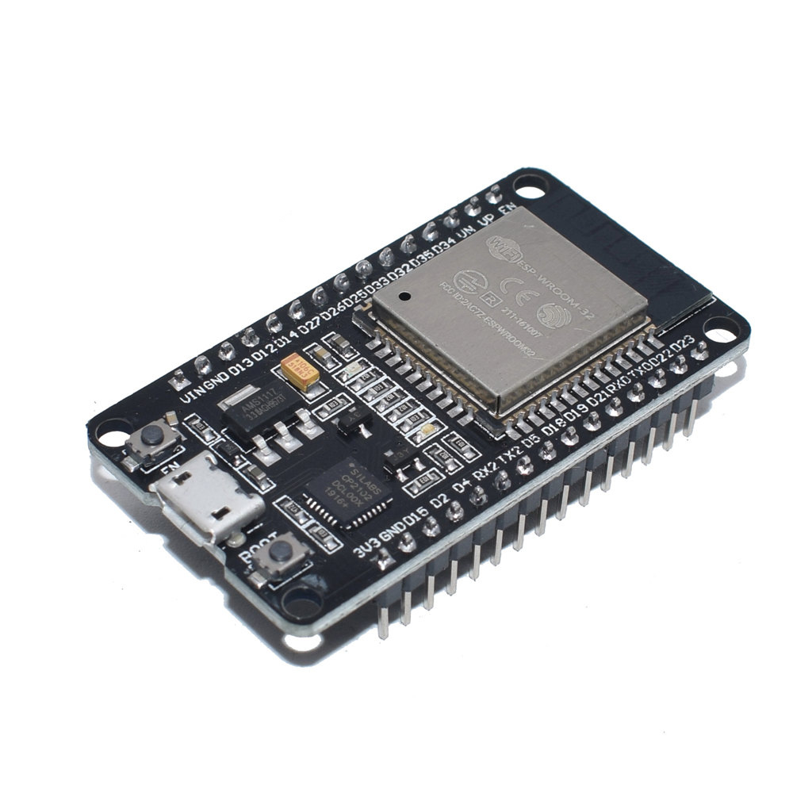
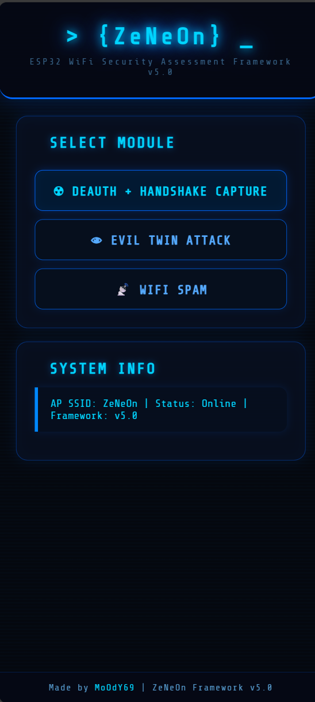
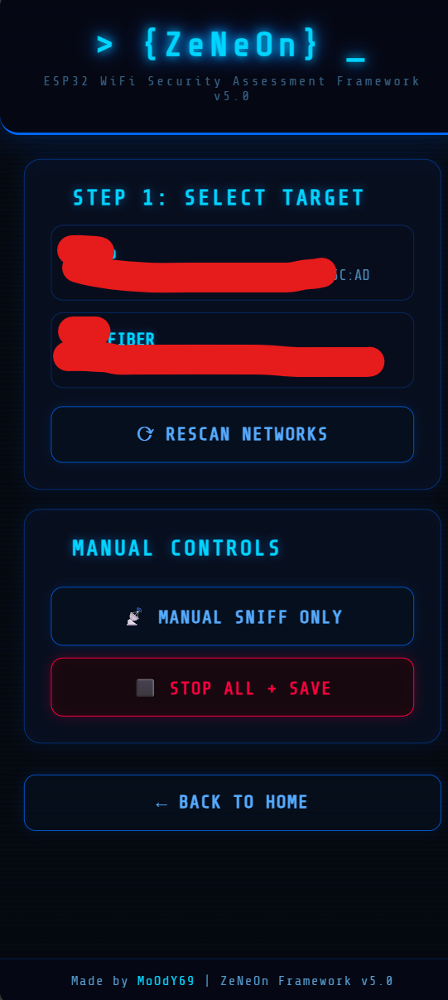
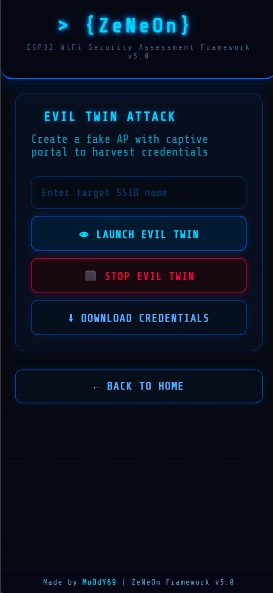
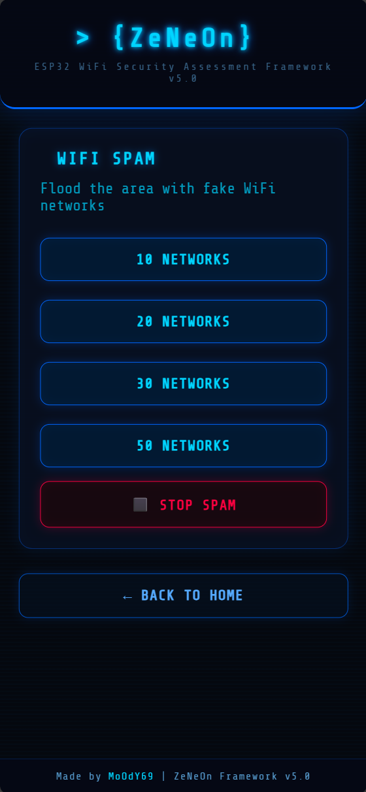

# ZeNeOn — ESP32 WiFi Security Assessment Framework

<div align="center">


**⚠️Educational Purpose Only⚠️**



*ESP32-WROOM-32 Development Board*

</div>

---

<details>
<summary><strong>User Interface</strong></summary>

<div align="center">

 
 

*Web interface screenshots showing various attack modules*

</div>

</details>

<details>
<summary><strong>Features</strong></summary>

| Module | Description |
|--------|-------------|
| **Deauth Attack** | Targeted 802.11 deauthentication with automatic client discovery, broadcast + unicast frame injection, and configurable duration (10–120s) |
| **Evil Twin** | Fake AP with captive portal for credential harvesting. Auto DNS redirect, credential logging to SPIFFS |
| **WiFi Spam** | Beacon frame flooding — spawn up to 50 fake WiFi networks |
| **Packet Capture** | Promiscuous mode sniffer with PCAP export. Auto-captures during deauth attacks |
| **Handshake Detection** | Real-time EAPOL 4-way handshake frame detection and logging |

</details>

<details>
<summary><strong>Hardware Requirements</strong></summary>

- **ESP32** development board (ESP32-WROOM-32 recommended)
- Micro-USB cable
- Computer with Arduino IDE

> **Note:** ESP8266 is **not** supported. This project requires the ESP32's raw 802.11 frame injection capability.

</details>

<details>
<summary><strong>Installation</strong></summary>

### 1. Install Arduino IDE and ESP32 Board Support

1. Download and install [Arduino IDE](https://www.arduino.cc/en/software)
2. Go to **File > Preferences** and add this URL to "Additional Board Manager URLs":
   ```
   https://raw.githubusercontent.com/espressif/arduino-esp32/gh-pages/package_esp32_index.json
   ```
3. Go to **Tools > Board > Boards Manager**, search for `esp32`, and install **esp32 by Espressif Systems**

### 2. Configure Board Settings

| Setting | Value |
|---------|-------|
| Board | ESP32 Dev Module |
| Upload Speed | 921600 |
| CPU Frequency | 240MHz |
| Flash Frequency | 80MHz |
| Flash Size | 4MB (32Mb) |
| Partition Scheme | Default 4MB with spiffs |
| PSRAM | Disabled |

### 3. Upload

1. Clone this repository:
   ```bash
   git clone https://github.com/InoshMatheesha/ZeNeOn-ESP32-WiFi-Framework.git
   ```
2. Open `cyber_hunt_tool_v4.ino` in Arduino IDE
3. Ensure `wsl_bypasser.c` is in the **same folder** as the `.ino` file
4. Select your ESP32 board and COM port
5. Click **Upload**

</details>

<details>
<summary><strong>Usage</strong></summary>

1. Power on the ESP32
2. Connect to the WiFi network:
   - **SSID:** `ZeNeOn`
   - **Password:** `pakaya@12`
3. Open a browser and navigate to `http://192.168.4.1`
4. Select a module from the web interface

### Deauth Attack
1. Select a target network from the scan list
2. Wait for client discovery (automatic)
3. Choose attack duration (10s / 20s / 30s / 60s)
4. Packet capture starts automatically during the attack
5. Download the `.pcap` file after the attack completes

### Evil Twin
1. Enter the target SSID name
2. Launch — the ESP32 AP switches to the spoofed SSID
3. Reconnect to the spoofed network
4. Clients connecting will see a login portal
5. Captured credentials are stored and available for download

### WiFi Spam
1. Select the number of fake networks (10–50)
2. Fake SSIDs appear in nearby WiFi scan results
3. Stop anytime from the web interface

</details>


<details>
<summary><strong>Project Structure</strong></summary>

```
ZeNeOn-ESP32-WiFi-Framework/
├── cyber_hunt_tool_v4.ino   # Main firmware (UI + attack logic)
├── wsl_bypasser.c           # WiFi stack bypass for raw frame injection
└── README.md
```

### Key Components

- **wsl_bypasser.c** — Overrides `ieee80211_raw_frame_sanity_check()` to enable raw 802.11 management frame transmission (deauth/disassoc). Must be a `.c` file for the weak symbol linker override to work.
- **Web Interface** — Responsive interface served directly from the ESP32, built with HTML/CSS/JS.
- **SPIFFS** — Used for storing PCAP capture files and harvested credentials on-device.

</details>

<details>
<summary><strong>Technical Details</strong></summary>

- **Frame Injection:** Raw 802.11 deauth (0xC0) and disassoc (0xA0) frames with multiple reason codes
- **Client Discovery:** Passive sniffing of management and data frames to identify connected clients
- **Targeted Deauth:** Unicast frames sent to each discovered client + broadcast floods
- **PCAP Format:** Standard libpcap format (magic: `0xa1b2c3d4`, link type: 802.11)
- **EAPOL Parsing:** Identifies all 4 messages of the WPA 4-way handshake
- **DNS Hijack:** Captive portal redirect via DNS server for Evil Twin attack
- **TX Power:** Configured to maximum (84 = 21dBm)

</details>

## Disclaimer

> **This tool is intended strictly for educational purposes and authorized security testing only.**
>
> Unauthorized access to computer networks is **illegal**. The author is **not responsible** for any misuse of this software. Always obtain **explicit written permission** before testing networks you do not own.
>
> Use responsibly and ethically. Know your local laws.

## Contributing

Contributions are welcome. Feel free to:
- Open issues for bugs or feature requests
- Submit pull requests with improvements
- Share ideas for new modules

## Acknowledgements

This project was developed as a learning exercise. Special thanks to:
- **Google Gemini** and **OpenAI ChatGPT** — for teaching and guiding me throughout the development process, helping me understand ESP32 programming, 802.11 frame structures, and embedded web server concepts.
- The open-source ESP32 community and Espressif documentation.

## License

This project is licensed under the [MIT License](LICENSE).

## Author

**Inosh Matheesha** — [@InoshMatheesha](https://github.com/InoshMatheesha)

---

<div align="center">

**ZeNeOn** Framework v4.0 — ESP32 WiFi Security Assessment

</div>
